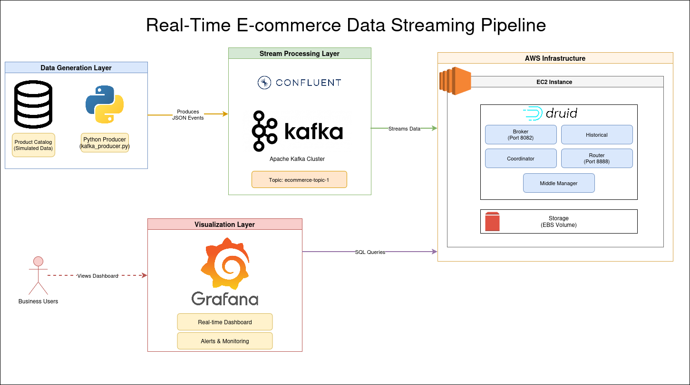

# Real-Time E-commerce Streaming Pipeline
> *A comprehensive Big Data project demonstrating real-time ingestion, processing, and visualization of high-velocity sales data.*

## Project Overview

This project simulates a high-traffic e-commerce platform (specializing in TV sales) and builds an end-to-end streaming data pipeline. The goal was to master the architecture of modern real-time data systems, moving from raw event generation to actionable business intelligence dashboards in milliseconds.

The system generates realistic transaction data, streams it through **Apache Kafka (Confluent Cloud)**, ingests it into **Apache Druid** running on **AWS EC2** for sub-second queries, and visualizes KPIs on **Grafana**.

---
## Architecture



The pipeline consists of four main stages:

1.  **Ingestion Source (Python)**: A custom script simulates user behavior and purchases based on a real-world dataset (`TV_DATASET_USA.csv`). It enriches data with geolocation, payment status, and user agent details before serializing it to JSON.
2.  **Message Broker (Kafka)**: Data is streamed to a specialized topic on **Confluent Cloud**, ensuring durability and decoupling the producer from consumers.
3.  **Real-Time Analytics (Druid)**: An **Apache Druid** cluster deployed on an **AWS EC2** instance consumes the Kafka stream. It indexes data in real-time
4.  **Visualization (Grafana)**: A dashboard connects to Druid via SQL/JSON to display live metrics like "Revenue per Second", "Top Selling Brands", and "Failed Transactions".

---


## How to Run

### Prerequisites
- Python 3.8+
- AWS Account (for EC2)
- Confluent Cloud Account
- connected to your Druid EC2 server
- connected to your Grafana instance
- 

### Steps
1.  **Clone the repo**:
    ```bash
    git clone https://github.com/hachemboudoukha/bestbuy-streaming-pipeline.git
    cd bestbuy-streaming-pipeline
    ```

2.  **Install Dependencies**:
    ```bash
    pip install pandas confluent-kafka
    ```

3.  **Configure Credentials**:
    Copy the example environment file:
    ```bash
    cp .env.example .env
    ```
    Open `.env` and fill in your Confluent Cloud details (BOOTSTRAP_SERVERS, SASL_USERNAME, SASL_PASSWORD).

4.  **Start the Stream**:
    ```bash
    python scripts/kafka_producer.py
    ```

5.  **Visualize**:
    Open your Grafana instance (connected to your Druid EC2 server) and watch the metrics update in real-time!

---

## Sample Analytics (SQL)

The system supports powerful SQL queries on the stream:

```sql
-- Calculate real-time revenue by Brand for the last hour
SELECT 
  "brand", 
  SUM("total_amount") as "total_sales"
FROM "ecommerce-topic-1"
WHERE __time >= CURRENT_TIMESTAMP - INTERVAL '1' HOUR
GROUP BY "brand"
ORDER BY "total_sales" DESC
```